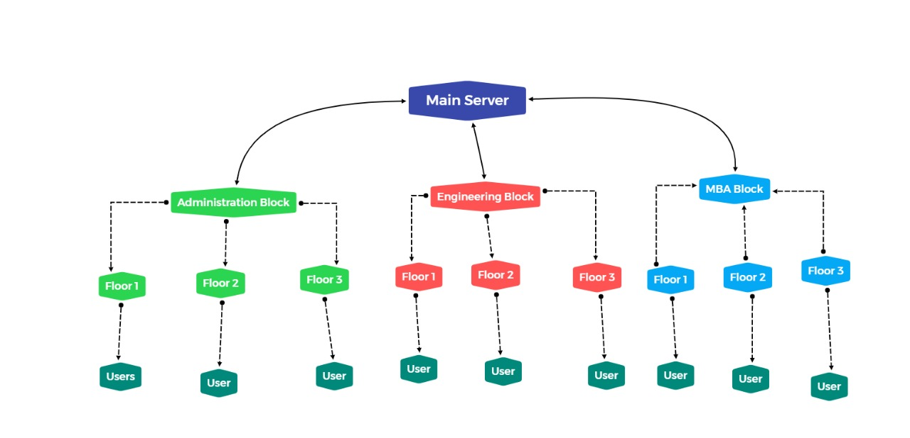

# Campus-Area-Network-Design-CN
This was a campus area network designed under 18CSC302J Lab

This project was made and implemented in CISCO Packet Tracer
It also uses the famous "CISCO 3 Layer Architecture"

Team Members:-
Amal Jogy,
Ananya Trivedi,
Dhanush N. ,
V.Harish Raghavendra,
